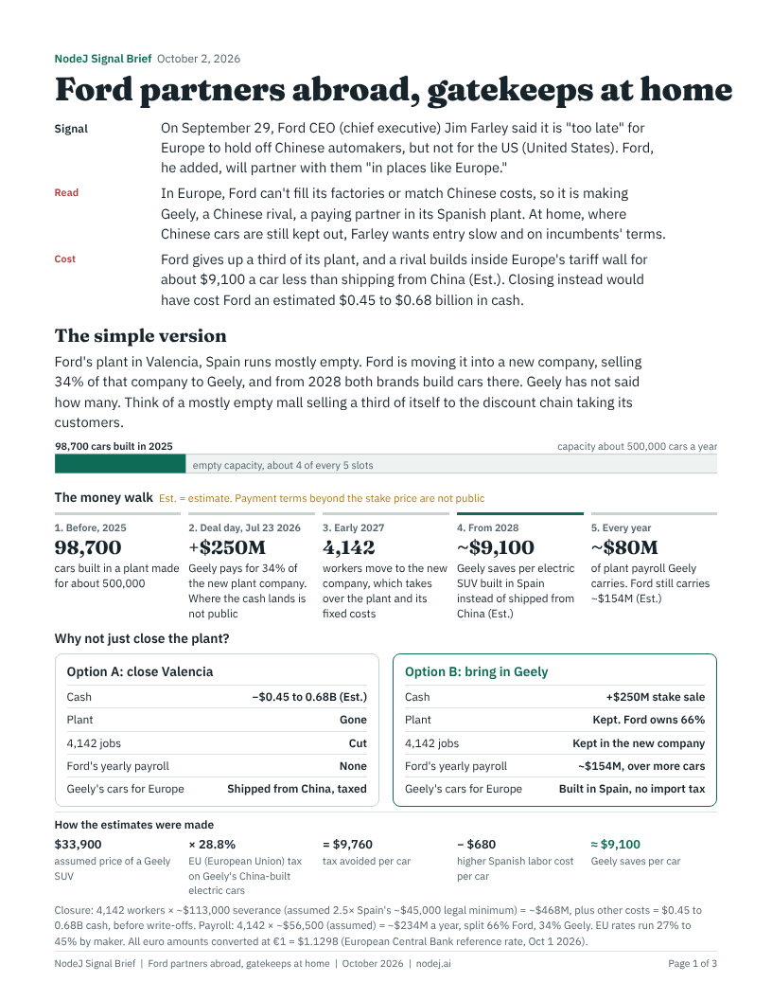

# NodeJ Signal Brief

[](https://creativecommons.org/licenses/by/4.0/)  [](https://github.com/nodej-ai/signal-brief/stargazers)

A four-step prompt that turns one news signal into a sourced research report and a three-page brief a busy executive can read in three minutes.

Created by Julian Tang, NodeJ ([nodej.ai](https://nodej.ai)). Free to use under [CC BY 4.0](LICENSE.md).

If this helps, star the repo so others can find it.



## What you get

Files are named `signal-brief-<slug>-<date>`, for example `signal-brief-ford-geely-europe-2026-10-03.pdf`.

| Output | What it is |
|---|---|
| `...-report.md` | The research: deal map, how it works, the money step by step, the alternative, who pays and who gains, history, what is not being said, watch list, quote bank, glossary, corrections log. Every figure sits in a Figures ledger with its source, date, grade, and the exact sentence it came from. |
| `....pdf` | Three pages. Page 1 teaches how the deal works and why. Page 2 shows who else is doing it and what it means for you. Page 3 has the twist, the history, three questions for an executive, and what to watch. |
| `...-reader-test.md` | A separate reader who never saw the research flags every place they got lost. |
| `...-fact-check.md` | A separate fact checker matches every number and claim in the brief to the research. |
| `...-timing.log` | How long each step took and how many lookups it used. |

## The four steps

1. **Research.** Four parts with a lookup budget each, stopping when each part is done. Every number goes in a ledger with a source, a date, a grade, and the exact sentence behind it.
2. **Draft.** Write the brief from the research only, in teaching order: what happened, how it works, why, what it costs, what you do. Page 1 uses only the strongest figures.
3. **Reader test and fact check.** A fresh reader logs every "I don't get it," "why?" and "so what?" A fact checker logs every number or claim the research does not support.
4. **Fix and fit.** Answer every item from the research or cut the line. Recompute every estimate. Three pages exactly.

## Why four steps

The first version was one prompt, one pass. It read well, and four of its numbers were wrong. Splitting the work into steps fixed it: research first, then writing, then a fresh reader checking the writing, then fixes. Each step catches what the last one missed.

Steps 3 and 4 are a loop: a reader who never saw the research flags what is unclear, the writer fixes it, and the reader checks again. Two rounds, then stop.

## Pick your level

| Level | What you do | Best for |
|---|---|---|
| **1. Paste** | Copy all of [`signal-brief-prompt.md`](signal-brief-prompt.md) into a chat, then type your signal below it | Any model with web search and code, including ChatGPT |
| **2. Claude Project** | Create a Project and paste the prompt into its **project instructions** (not as an uploaded file). After that, every chat in the project is just your signal | Claude users who want zero setup after the first time |
| **3. Claude plugin** | Install from the NodeJ marketplace (below). Adds a page template, a fit check, and a separate reader agent | Claude users who want the most consistent briefs |

A signal is the headline or a one-sentence fact. For example: "Signal: Ford's CEO says it is too late for Europe to hold off Chinese automakers, but not for the US."

**Runs best on:** Claude with web search and code execution turned on, or ChatGPT with deep research. If your tool can't make a PDF, ask for the HTML file and print it to PDF from your browser.

## Install the Claude plugin

One marketplace works everywhere. Install it once on claude.ai and it also appears in Claude Code.

- **claude.ai, desktop, or Cowork:**
  1. Go to [Customize > Plugins](https://claude.ai/customize/plugins) and choose **Add > Add marketplace > Add from a repository**.
  2. In **URL**, type `nodej-ai/nodej` and choose **Sync**.
  3. On the **Discover** tab, find **Signal Brief** and choose **Add**.
  4. Updates: leave **Sync automatically** off and choose **Check for updates** on the marketplace when you want the latest version. Turning auto-sync on asks you to give the Claude GitHub App read and write access to your code, which a public marketplace does not need.
- **Claude Code:**

```
/plugin marketplace add nodej-ai/nodej
/plugin install signal-brief@nodej
```

Then ask for a brief ("brief this: ...") or, in Claude Code, run `/signal-brief:signal-brief` followed by your signal. In claude.ai chat, type `/` and pick **signal-brief**.

The plugin reads the same prompt file as this repo, so the two never drift. On top of the prompt it adds:

| Piece | What it does |
|---|---|
| `skills/signal-brief/assets/template.html` | A three-page US Letter layout with every section in place, so the model writes content, not CSS |
| `skills/signal-brief/scripts/fit_check.py` | Checks the finished PDF: exactly three pages, no type under 8 point (footer 7.5), the method credit on every page, nothing over the footer. The brief ships only on PASS |
| `skills/signal-brief/scripts/render.py` | Turns the HTML into a PDF and warns when a page overflows |
| `skills/signal-brief/scripts/ledger_check.py` | Checks that every number in the brief traces to the research ledger, every estimate recomputes from its formula, and page 1 uses only top-grade figures |
| `skills/signal-brief/scripts/bar.py` | Draws the page-1 picture: one bar for the core proportion, from two research figures, hatched when it is an estimate |
| `skills/signal-brief/scripts/timing.py` | Writes the timing log and prints minutes per step |
| `agents/fact-checker.md` | The Step 3 fact checker as its own agent, run alongside the reader (Claude Code and Cowork) |
| `agents/reader.md` | The Step 3 reader as its own agent, given only the brief, never the research (Claude Code and Cowork; chat uses a fresh pass) |

## Examples

| Brief | Signal |
|---|---|
| [Ford partners abroad, gatekeeps at home](examples/nodej-signal-brief-ford-geely-europe-2026-10-02.pdf) | Ford's CEO says it is "too late" for Europe to hold off Chinese automakers, but not for the US |
| [Amazon is shopping for lenders](examples/nodej-signal-brief-amazon-leaseback-2026-10-02.pdf) | Amazon in talks to move about $8 billion of AI chips off its balance sheet |
| [Apple is financing the refresh](examples/nodej-signal-brief-chromebook-to-apple-2026-10-02.pdf) | A Texas school district swaps Chromebooks for Apple |
| [The anchor tenant returns](examples/nodej-signal-brief-power-deals-2026-10-01.pdf) | Meta signs 20-year nuclear power deals |
| [Banned before it arrived](examples/nodej-signal-brief-maryland-grocery-pricing-2026-10-04.pdf) | Maryland's ban on personal-data pricing at large grocers and delivery apps; shows the state comparison grid and "What each side leaves out" |
| [The yield was their own money](examples/nodej-signal-brief-ahp-hotel-reit-chapter11-2026-10-04.pdf) | Two retail-funded REITs holding Hilton- and Marriott-branded hotel stakes file Chapter 11 after an SEC settlement |

## Credit

Use it, change it, share it, sell what you make with it. Keep this line with any copy or adaptation:

> NodeJ Signal Brief method by Julian Tang, nodej.ai (CC BY 4.0)

Briefs made with the prompt carry "Method: NodeJ Signal Brief (nodej.ai)" in the footer.

## Want one for your industry?

Send a signal to julian@nodej.ai.

See [CHANGELOG.md](CHANGELOG.md) for what changed and why.
